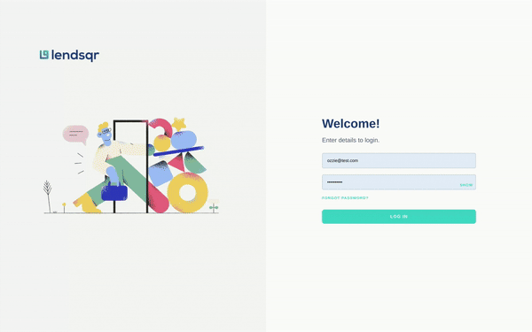

[](https://www.typescriptlang.org/)
[](https://app.netlify.com/sites/ozioma-okonicha-lendsqr-fe-test/deploys)
<br>

<!-- PROJECT LOGO -->
<br />
<p align="center">
  <a>
    
  </a>

<h1 align="center">Lendsqr Frontend Test Task</h1>

  <p align="center">
    By Ozioma Okonicha
    <br />
    <a href="https://github.com/Ozziekins/lendsqr-fe-test#readme"><strong>Explore the docs »</strong></a>
    <br />
    <br />
    <a href="mailto:nenubariozioma@gmail.com">Contact 📧</a>
    ·
    <a href="https://ozioma-okonicha-lendsqr-fe-test.netlify.app/">Demo 👀</a>
  </p>


<!-- TABLE OF CONTENTS -->
<details open="open">
  <summary>Table of Contents 📑</summary>
  <ol>
    <li>
      <a href="#description">Description</a>
    </li>
    <li><a href="#features">Features</a></li>
    <li><a href="#technologies-used">Technologies Used</a></li>
    <li>
      <a href="#getting-started">Getting Started</a>
      <ul>
        <li><a href="#prerequisites">Prerequisites</a></li>
        <li><a href="#installing">Installing</a></li>
      </ul>
    </li>
    <li><a href="#usage">Usage</a></li>
    <li><a href="#license">License</a></li>
    <li><a href="#acknowledgments">Acknowledgements</a></li>
  </ol>
</details>

# Lendsqr Management Dashboard 📊

## Description
This Management Dashboard is a simple, intuitive tool designed to manage user data effectively. It allows administrators to view, filter, and manage users based on various criteria such as organization affiliation, status, and personal information. This dashboard is built with React, using Material-UI for the front-end components, ensuring a responsive and accessible user interface.

> Read more about it [here](https://sulfuric-brochure-f82.notion.site/Lendsqr-Management-Dashboard-Documentation-968a4e193393414dbf45dbb446b19445?pvs=74).

## Features
- **Dynamic User Filtering:** Filter users by organization, status, name, and more.
- **User Status Management:** Quickly change user statuses to active, or blacklisted.
- **Responsive Design:** Fully responsive design that works on desktop and mobile devices.
- **Pagination and Search:** Efficient navigation through user data with search and pagination capabilities.

## Technologies Used
- React.js
- Material-UI
- Node.js (for mock backend API)
- SCSS for styling

## Getting Started
Follow these instructions to get a copy of the project up and running on your own local machine for trying out purposes.

### Prerequisites
What you need to install before using:
```bash
node.js
npm
```

### Installing
A step-by-step to get a development environment running:

1. **Clone the repository**
   ```bash
   git clone https://github.com/Ozziekins/lendsqr-fe-test.git
   ```
2. **Navigate to project directory**
   ```bash
   cd lendsqr-fe-test-task
   ```
3. **Install dependencies**
   ```bash
   npm install
   ```
4. **Run the mock server**
   ```bash
   node server-middleware.js
   ```
5. **Open another terminal and run the development server**
   ```bash
   npm start
   ```

The server will start running on `http://localhost:3000/`.

## Usage
[](https://www.loom.com/share/6c76d59b21fc4cb4813ab8d4ee4153ca?sid=5be8a2d9-f4a5-4179-ab93-a8813c81fe3c)

Click on the GIF above to watch a full usage tutorial!

## License
This project is licensed under the MIT License - see the [LICENSE.md](LICENSE) file for details

## Acknowledgments
- Lendsqr HR team for providing this task 🙏🏾

---